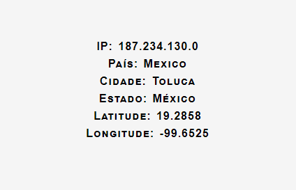
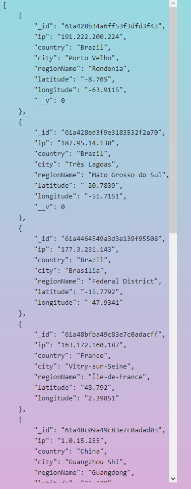

# Onde eu estou (Where am I)
> Este projeto tem como objetivo retornar informações sobre o endereço lógico (endereço IP) do usuário. As informações o qual são retornadas são respectivamente: país, cidade, estado, latitude e longitude.

> A latitude e longitude retornadas pela aplicação não utilizam precisão para bairro, rua, número da residencia. Apenas será considerado a cidade o qual o usuário se encontra.

# Sobre o projeto
> O projeto se constitui de um frontend, onde o usuário deve informar o seu endereço de ip para que o retorno seja realizado. A sua construção utiliza apenas de elementos básicos da linguagem HTML, como: forms, input, div, p. Seu design utiliza alguns componentes do CSS para estilizar o background, letras e icone da página.

> (Caso não saiba seu ip, consulte a página: [Meu Ip](https://www.meuip.com.br))

> O backend construido com NodeJS recebe o endereço e consome a API de localização [IP-API](https://ip-api.com) o qual retorna um JSON com diversas informações sobre o endereço IP.

> A aplicação deve ser acessada utilizando o link [Onde estou](https://application2-nathandezan.cloud.okteto.net).

# Tecnologias Utilizadas
* Express
* Axios 
* Cors
* Mongoose
* MongoDB
* Okteto
* Docker
* Kubernetes

> **Express**, framework para aplicação web utilizando Node.js, que permite o uso de métodos HTTP.

> **Axios**, é um cliente HTTP que tem como base o uso de promisses para Node.js e navegador.

> **Cors**, permite que aplicativos web executem em um domínio com permissão para acessar recursos de um servidor de outra origem.

> **Mongoose**, framework para comunicação com o MongoDB.

> **MongoDB**, banco de dados não-relacional utilizado para salvar as buscas realizadas na aplicação.

> **Okteto**, plataforma gratuita para construção de aplicação utilizando Kubernetes

> **Docker**, framework para construção de containers.

> **Kubernetes**, framework que utiliza como base containers para construção de pods, esses que possuem diversas vantagens se comparado com o uso de containers, integração, desempenho, comunicação.

# Como utilizar
> A aplicação suporta o formato de ip: xxx.xxx.xxx.xxx, caso o valor informado seja inválido o retorno será **undefined**.

> Segue uma possível entrada:

`187.234.130.0`

> E seu respectivo retorno:

> 

> Ao pressionar o botão "Histórico de Localizações" a aplicação retornará todos os endereços ip já consultados.

> 